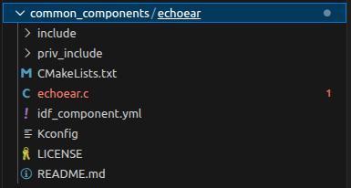
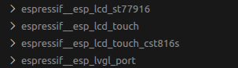
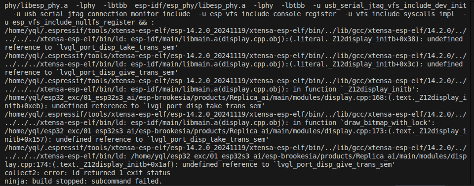
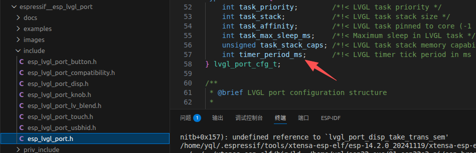
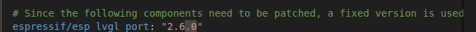
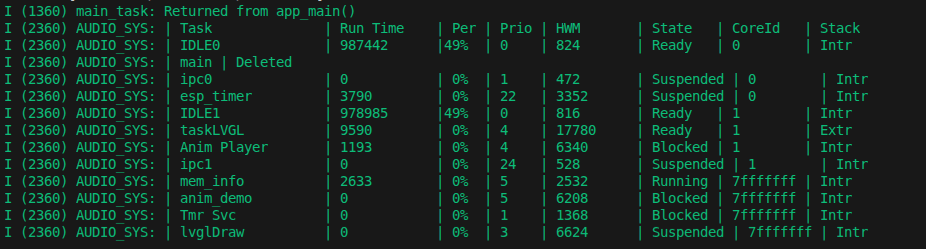
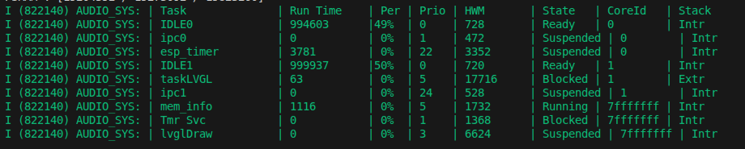

目标：学习esp32s3的显示部分 
添加了/home/yql/esp32_exc/01_esp32s3_ai/esp-brookesia/products/Replica_ai/common_components/echoear

自动拉取
/home/yql/esp32_exc/01_esp32s3_ai/esp-brookesia/products/Replica_ai/managed_components


添加python环境 /home/yql/esp32_exc/01_esp32s3_ai/esp-brookesia/products/Replica_ai/tools/patches/esp_lvgl_port.patch 主要是文件替代  现在编译出了一问题



猜测是 没替换成功


解决方法  版本问题 绝！


用户想要详细了解 `display_init` 函数的初始化流程，以及它依赖的 `managed_components` 中各个组件的函数。

我需要：
1. 读取 `display_init` 函数的完整实现
2. 分析它调用的每个函数
3. 追踪这些函数到 `managed_components` 中的具体组件
4. 整理出完整的依赖关系图

让我先读取 display.cpp 文件，然后分析每个调用的函数。
我来详细分析 `display_init` 函数的初始化流程及其依赖关系。
现在我需要追踪 display_init 函数调用的每个函数，并找到它们在 managed_components 中的来源。

从 display.cpp 中，我看到主要的函数调用：
1. `bsp_power_init(true)` - 来自 echoear 组件
2. `bsp_display_start_with_config(&cfg)` - 来自 echoear 组件
3. `clear_display(disp)` - 本地函数
4. `bsp_display_backlight_on()` - 来自 echoear 组件

而 echoear 组件（在 common_components/echoear/）又依赖于 managed_components 中的组件。

让我读取 echoear.c 来看它的实现。
好的，现在我需要追踪 display_init 函数的完整调用链。让我梳理一下：

从 display.cpp 的 display_init 函数（第 29-152 行）：

1. `bsp_power_init(true)` - 第 36 行
   - 来自 echoear/echoear.c 第 535-557 行
   
2. `bsp_display_start_with_config(&cfg)` - 第 53 行
   - 来自 echoear/echoear.c 第 504-517 行
   - 这个函数又调用了：
     a. `lvgl_port_init(&cfg->lvgl_port_cfg)` - 第 507 行
     b. `bsp_display_brightness_init()` - 第 509 行
     c. `bsp_display_lcd_init(cfg)` - 第 511 行
     d. `bsp_display_indev_init(disp)` - 第 514 行

3. `clear_display(disp)` - 第 57 行
   - 本地函数（第 179-188 行）

4. `bsp_display_backlight_on()` - 第 60 行
   - 来自 echoear/echoear.c 第 133-136 行

现在让我追踪这些子函数：

### bsp_display_start_with_config (echoear/echoear.c:504-517)

#### a. lvgl_port_init() - echoear.c:507
这是 esp_lvgl_port 组件的函数，在 managed_components/espressif__esp_lvgl_port/

#### b. bsp_display_brightness_init() - echoear.c:509


这是一个背光配置函数，用于设置 LEDC（LED PWM）外设，实现显示屏幕背光控制。

#### c. bsp_display_lcd_init(cfg) - echoear.c:511
这是一个显示 LCD 初始化函数，负责配置和初始化显示相关硬件。

函数首先调用 `bsp_display_new()`，这会执行一系列初始化步骤。首先通过 `bsp_display_brightness_init()` 设置背光，然后通过 `bsp_i2c_init()` 初始化 I2C 总线。接着使用 `spi_bus_initialize()` 初始化 SPI 总线，配置显示接口参数。

完成硬件初始化后，通过 `esp_lcd_new_panel_io_spi()` 创建面板 IO，为后续显示操作做准备。最终调用 `lvgl_port_add_disp()` 添加 LCD 屏幕到 LVGL 显示系统。 确认了 `esp_lcd_new_panel_io_i2c_v2()` 属于 ESP-IDF 的 LCD 组件。这个函数来自 ESP-IDF 的 `esp_lcd` 组件，负责创建 I2C 面板 IO。我将继续分析 `lvgl_port_add_touch()` 的来源，它位于 `espressif__esp_lvgl_port` 组件中。
现在让我追踪各个子函数的来源，查看 managed_components 的头文件：
让我换个方式搜索，直接列出这些组件的源文件结构。
好的，现在我需要整理一个完整的函数调用依赖图。让我基于我看到的代码来总结：

从 display_init 开始的调用链：

1. display_init (display.cpp:29-152)
   ├─ bsp_power_init() 
   │  └─ [ESP-IDF] gpio_config(), gpio_set_level()
   ├─ bsp_display_start_with_config()
   │  ├─ lvgl_port_init()
   │  │  └─ [espressif__esp_lvgl_port] LVGL 初始化
   │  ├─ bsp_display_brightness_init()
   │  │  └─ [ESP-IDF] ledc_timer_config(), ledc_channel_config()
   │  ├─ bsp_display_lcd_init()
   │  │  ├─ bsp_display_new()
   │  │  │  ├─ bsp_display_brightness_init() (同上)
   │  │  │  ├─ bsp_i2c_init()
   │  │  │  │  └─ [ESP-IDF] i2c_new_master_bus()
   │  │  │  ├─ [ESP-IDF] spi_bus_initialize()
   │  │  │  ├─ [ESP-IDF] esp_lcd_new_panel_io_spi()
   │  │  │  └─ [espressif__esp_lcd_st77916] esp_lcd_new_panel_st77916()
   │  │  ├─ [ESP-IDF] esp_lcd_panel_reset()
   │  │  ├─ [ESP-IDF] esp_lcd_panel_init()
   │  │  ├─ [ESP-IDF] esp_lcd_panel_disp_on_off()
   │  │  └─ [espressif__esp_lvgl_port] lvgl_port_add_disp()
   │  └─ bsp_display_indev_init()
   │     ├─ bsp_touch_new()
   │     │  ├─ bsp_i2c_init() (同上)
   │     │  ├─ [ESP-IDF] esp_lcd_new_panel_io_i2c_v2()

I see the initialization process continues with configuring touch input and setting up the display peripherals. The system involves multiple ESP-IDF components and board support package functions to initialize the display, touch, and various hardware interfaces. I continue the process by retrieving the panel handle from the display, then initialize touch input. I create a touch configuration using BSP parameters and establish the touch input device. The process involves leveraging BSP and ESP library functions to set up the display's interaction capabilities, ensuring touch detection and input are properly configured.

The initialization follows a systematic approach: retrieving panel data, configuring touch settings, and creating the touch input mechanism through LVGL port. This ensures precise interaction handling for the display's touch capabilities.
根据代码分析，我为你整理了 `display_init` 函数的完整初始化流程及其依赖关系。

## `display_init` 函数详细初始化流程

### 函数签名
```cpp
bool display_init(bool default_dummy_draw)
```
**位置**: `main/modules/display.cpp:29-152`

**功能**: 初始化 LCD 显示系统、背光控制、LVGL 图形库和触摸屏

---

## 完整调用链及依赖关系

### 📋 整体架构图

```
display_init (display.cpp)
    │
    ├─ bsp_power_init(true)                    ← echoear/echoear.c:535-557
    │     └─ [ESP-IDF] gpio_config()
    │     └─ [ESP-IDF] gpio_set_level()
    │
    ├─ bsp_display_start_with_config(&cfg)       ← echoear/echoear.c:504-517
    │     │
    │     ├─ lvgl_port_init(&cfg->lvgl_port_cfg)         ← espressif__esp_lvgl_port
    │     │     ├─ 创建 LVGL 任务 (优先级:4, 核:Core1, 栈:20KB)
    │     │     ├─ 初始化 LVGL 定时器 (5ms)
    │     │     └─ [lvgl__lvgl] lv_init()
    │     │
    │     ├─ bsp_display_brightness_init()         ← echoear/echoear.c:85-109
    │     │     ├─ [ESP-IDF] ledc_timer_config()     (LED PWM定时器: 4000Hz)
    │     │     └─ [ESP-IDF] ledc_channel_config()   (背光PWM通道配置)
    │     │
    │     ├─ bsp_display_lcd_init(cfg)            ← echoear/echoear.c:402-438
    │     │     │
    │     │     ├─ bsp_display_new(&bsp_disp_cfg, ...)  ← echoear/echoear.c:325-400
    │     │     │     │
    │     │     │     ├─ bsp_display_brightness_init()    (同上)
    │     │     │     ├─ bsp_i2c_init()                  ← echoear/echoear.c:48-65
    │     │     │     │     └─ [ESP-IDF] i2c_new_master_bus()
    │     │     │     │
    │     │     │     ├─ [ESP-IDF] spi_bus_initialize()      (QSPI总线初始化)
    │     │     │     │
    │     │     │     ├─ [ESP-IDF] esp_lcd_new_panel_io_spi()  (SPI面板IO创建)
    │     │     │     │
    │     │     │     ├─ [espressif__esp_lcd_st77916] esp_lcd_new_panel_st77916()
    │     │     │     │     ├─ 发送厂商初始化命令序列 (138条命令)
    │     │     │     │     ├─ 配置 QSPI 接口模式
    │     │     │     │     └─ 设置 RGB 颜色顺序 (RGB565)
    │     │     │     │
    │     │     │     ├─ [ESP-IDF] esp_lcd_panel_reset()    (复位LCD)
    │     │     │     ├─ [ESP-IDF] esp_lcd_panel_init()     (初始化LCD)
    │     │     │     └─ [ESP-IDF] esp_lcd_panel_disp_on_off(true)  (开启显示)
    │     │     │
    │     │     ├─ [ESP-IDF] esp_lcd_panel_disp_on_off(true)
    │     │     │
    │     │     └─ [espressif__esp_lvgl_port] lvgl_port_add_disp(&disp_cfg)
    │     │           ├─ 配置显示分辨率 (360×360)
    │     │           ├─ 分配帧缓冲区 (360×360×2 = 259KB)
    │     │           ├─ 启用双缓冲
    │     │           ├─ 配置 DMA 缓冲
    │     │           ├─ 设置旋转参数 (swap_xy, mirror_x, mirror_y)
    │     │           └─ [lvgl__lvgl] lv_display_create()
    │     │
    │     └─ bsp_display_indev_init(disp)          ← echoear/echoear.c:472-484
    │           │
    │           ├─ bsp_touch_new(...)               ← echoear/echoear.c:440-470
    │           │     │
    │           │     ├─ bsp_i2c_init()                   (同上)
    │           │     │
    │           │     ├─ [ESP-IDF] esp_lcd_new_panel_io_i2c_v2()
    │           │     │     └─ 创建 I2C 面板 IO (用于触摸)
    │           │     │
    │           │     └─ [espressif__esp_lcd_touch_cst816s] esp_lcd_touch_new_i2c_cst816s()
    │           │           ├─ 配置触摸分辨率 (360×360)
    │           │           ├─ 配置中断引脚 (INT)
    │           │           ├─ 配置复位引脚 (RST,与LCD共享)
    │           │           ├─ 设置坐标镜像/交换
    │           │           └─ 注册中断回调函数
    │           │
    │           └─ [espressif__esp_lvgl_port] lvgl_port_add_touch(&touch_cfg)
    │                 ├─ 将触摸句柄绑定到 LVGL 显示
    │                 └─ [lvgl__lvgl] lv_indev_create()
    │
    ├─ clear_display(disp)                      ← display.cpp:179-188 (if default_dummy_draw)
    │     ├─ 分配全屏缓冲区 (360×360×2 = 259KB 黑色像素)
    │     ├─ draw_bitmap_with_lock()
    │     │     ├─ [lvgl__lvgl] lv_display_get_user_data()  (获取panel_handle)
    │     │     ├─ [espressif__esp_lvgl_port] lvgl_port_disp_take_trans_sem()
    │     │     ├─ [ESP-IDF] esp_lcd_panel_draw_bitmap()  (绘制黑色清屏)
    │     │     ├─ [espressif__esp_lvgl_port] lvgl_port_disp_take_trans_sem(portMAX_DELAY)
    │     │     └─ [espressif__esp_lvgl_port] lvgl_port_disp_give_trans_sem()
    │     └─ [ESP-IDF] vTaskDelay(100ms)  (避免雪花屏)
    │
    └─ bsp_display_backlight_on()               ← echoear/echoear.c:133-136
          └─ bsp_display_brightness_set(100)
                └─ [ESP-IDF] ledc_set_duty()  (PWM占空比: 100% = 1023)
```

---

## 依赖组件及其函数清单

### 1️⃣ **common_components/echoear** (本地BSP组件)

| 函数名 | 功能 | 调用位置 |
|-------|------|---------|
| `bsp_power_init()` | 初始化电源管理GPIO | display.cpp:36 |
| `bsp_display_start_with_config()` | 启动显示系统 | display.cpp:53 |
| `bsp_display_backlight_on()` | 开启背光 (100%亮度) | display.cpp:60 |
| `bsp_display_brightness_init()` | 初始化LED背光PWM | echoear.c:509 |
| `bsp_display_lcd_init()` | 初始化LCD显示 | echoear.c:511 |
| `bsp_display_indev_init()` | 初始化触摸输入 | echoear.c:514 |
| `bsp_display_new()` | 创建LCD面板 | echoear.c:409 |
| `bsp_touch_new()` | 创建触摸控制器 | echoear.c:474 |
| `bsp_i2c_init()` | 初始化I2C总线 | echoear.c:333, 443 |

---

### 2️⃣ **managed_components/espressif__esp_lvgl_port** (LVGL移植层)

| 函数名 | 功能 | 调用位置 |
|-------|------|---------|
| `lvgl_port_init()` | 初始化LVGL核心<br>- 创建LVGL任务 (Core1, 20KB栈)<br>- 创建定时器 (5ms周期)<br>- 调用lv_init() | echoear.c:507 |
| `lvgl_port_add_disp()` | 添加LCD显示到LVGL<br>- 创建LVGL显示对象<br>- 分配帧缓冲区 (259KB)<br>- 配置双缓冲/DMA<br>- 设置分辨率 (360×360) | echoear.c:437 |
| `lvgl_port_add_touch()` | 添加触摸输入到LVGL<br>- 绑定触摸句柄到显示<br>- 创建输入设备对象<br>- 配置触摸回调 | echoear.c:483 |
| `lvgl_port_disp_take_trans_sem()` | 获取显示传输信号量 | display.cpp:168, 173 |
| `lvgl_port_disp_give_trans_sem()` | 释放显示传输信号量 | display.cpp:174 |

**依赖组件**: `lvgl__lvgl`

---

### 3️⃣ **managed_components/espressif__esp_lcd_st77916** (LCD驱动)

| 函数名 | 功能 | 调用位置 |
|-------|------|---------|
| `esp_lcd_new_panel_st77916()` | 创建ST77916 LCD驱动<br>- 发送138条厂商初始化命令<br>- 配置QSPI接口模式<br>- 设置RGB565颜色格式<br>- 配置GPIO复位电平 | echoear.c:384 |

**硬件配置**:
- 接口: QSPI (四线并行)
- 分辨率: 360×360
- 颜色: RGB565 (16位)
- 时钟: 由 BSP_LCD_PIXEL_CLOCK_HZ 定义

---

### 4️⃣ **managed_components/espressif__esp_lcd_touch_cst816s** (触摸驱动)

| 函数名 | 功能 | 调用位置 |
|-------|------|---------|
| `esp_lcd_touch_new_i2c_cst816s()` | 创建CST816S触摸控制器<br>- 配置触摸分辨率 (360×360)<br>- 配置中断GPIO (INT)<br>- 配置复位GPIO (与LCD共享)<br>- 设置坐标镜像/交换<br>- 注册中断回调 | echoear.c:467 |

**通信接口**: I2C (通过 i2c_handle)

---

### 5️⃣ **managed_components/lvgl__lvgl** (图形库核心)

| 函数名 | 功能 | 调用位置 |
|-------|------|---------|
| `lv_init()` | 初始化LVGL图形库 | lvgl_port_init() 内部 |
| `lv_display_create()` | 创建LVGL显示对象 | lvgl_port_add_disp() 内部 |
| `lv_indev_create()` | 创建LVGL输入设备对象 | lvgl_port_add_touch() 内部 |
| `lv_display_get_user_data()` | 获取显示用户数据 (panel_handle) | display.cpp:163 |

---

### 6️⃣ **ESP-IDF 内置组件**

| 函数名 | 所属组件 | 功能 | 调用位置 |
|-------|---------|------|---------|
| `gpio_config()` | driver/gpio | 配置GPIO模式 | echoear.c:544 |
| `gpio_set_level()` | driver/gpio | 设置GPIO电平 | echoear.c:546, 548 |
| `ledc_timer_config()` | driver/ledc | 配置PWM定时器 (4000Hz, 10位) | echoear.c:105 |
| `ledc_channel_config()` | driver/ledc | 配置PWM通道 | echoear.c:106 |
| `ledc_set_duty()` | driver/ledc | 设置PWM占空比 | echoear.c:122 |
| `ledc_update_duty()` | driver/ledc | 更新PWM占空比 | echoear.c:123 |
| `i2c_new_master_bus()` | driver/i2c | 创建I2C主机总线 | echoear.c:61 |
| `spi_bus_initialize()` | driver/spi_master | 初始化SPI/QSPI总线 | echoear.c:344 |
| `esp_lcd_new_panel_io_spi()` | esp_lcd | 创建SPI面板IO (QSPI) | echoear.c:359 |
| `esp_lcd_new_panel_io_i2c_v2()` | esp_lcd | 创建I2C面板IO | echoear.c:465 |
| `esp_lcd_panel_reset()` | esp_lcd | 复位LCD面板 | echoear.c:386 |
| `esp_lcd_panel_init()` | esp_lcd | 初始化LCD面板 | echoear.c:387 |
| `esp_lcd_panel_disp_on_off()` | esp_lcd | 开启/关闭LCD显示 | echoear.c:388 |
| `esp_lcd_panel_draw_bitmap()` | esp_lcd | 绘制位图到LCD | display.cpp:170 |
| `vTaskDelay()` | FreeRTOS | 延时任务 | display.cpp:58, echoear.c:554 |

---

## 初始化流程时间线

```
时间  0ms:  bsp_power_init(true)
         ├─ 配置电源GPIO为输出
         └─ 上电外设

时间 10ms:  lvgl_port_init()
         ├─ 创建 LVGL 任务 (优先级4, 核Core1)
         ├─ 创建 5ms 定时器
         └─ lv_init()

时间 20ms:  bsp_display_brightness_init()
         ├─ LEDC定时器配置 (4000Hz)
         └─ LEDC通道配置

时间 30ms:  bsp_i2c_init()
         └─ 初始化 I2C 总线

时间 40ms:  spi_bus_initialize()
         └─ 初始化 QSPI 总线

时间 50ms:  esp_lcd_new_panel_io_spi()
         └─ 创建 QSPI 面板 IO

时间 60ms:  esp_lcd_new_panel_st77916()
         ├─ 发送 138 条初始化命令
         ├─ 配置 QSPI 模式
         └─ 复位 LCD

时间 80ms:  lvgl_port_add_disp()
         ├─ 创建 LVGL 显示对象
         ├─ 分配帧缓冲区 (259KB × 2 = 518KB)
         └─ 配置双缓冲

时间 90ms:  esp_lcd_touch_new_i2c_cst816s()
         ├─ 配置触摸控制器
         └─ 注册中断回调

时间 100ms: lvgl_port_add_touch()
         └─ 绑定触摸到 LVGL

时间 110ms: clear_display()
         ├─ 绘制全屏黑色 (259KB)
         └─ 延时 100ms (避免雪花屏)

时间 210ms: bsp_display_backlight_on()
         └─ PWM 占空比 100% (1023)

时间 211ms: display_init() 返回 true
```

---

## 内存分配总结

| 内存类型 | 用途 | 大小 | 分配位置 |
|---------|------|------|---------|
| LVGL 任务栈 | LVGL任务运行栈 | 20KB | PSRAM (MALLOC_CAP_SPIRAM) |
| LVGL 帧缓冲区 | 显示缓冲 (双缓冲) | 259KB × 2 = 518KB | SRAM (DMA capable) |
| 清屏缓冲区 | 初始化黑色缓冲 | 259KB | DIRAM (std::vector) |
| I2C 句柄 | I2C总线控制 | 几KB | DIRAM |
| SPI 句柄 | QSPI总线控制 | 几KB | DIRAM |

---

## 配置参数说明

### LVGL 配置
```cpp
.lvgl_port_cfg = {
    .task_priority = 4,              // 任务优先级
    .task_stack = 20 * 1024,         // 栈大小 20KB (PSRAM)
    .task_affinity = 1,              // 运行在 Core1
    .task_max_sleep_ms = 500,         // 最大休眠 500ms
    .task_stack_caps = MALLOC_CAP_SPIRAM | MALLOC_CAP_8BIT,
    .timer_period_ms = 5,            // 5ms 刷新周期
}
```

### 显示配置
```cpp
.buffer_size = 360 * 360 = 129600,  // 帧缓冲区大小
.double_buffer = true,               // 双缓冲
.flags = {
    .buff_spiram = false,            // 缓冲区在 SRAM (DMA要求)
    .buff_dma = true,               // 启用 DMA
    .default_dummy_draw = true,      // 虚拟绘制模式
}
```

这就是 `display_init` 函数的完整初始化流程和依赖关系！


用户想让我重点解释 project_include.cmake 中的第 55 行：
```cmake
apply_patch_for_component("espressif__esp_lvgl_port" "esp_lvgl_port.patch")
```

并且提到了 tools 文件夹，我应该先看看这个文件的内容，然后看看 tools/patches/ 目录下有什么补丁文件。

让我先读取 project_include.cmake 的完整内容，然后看看 tools/patches/ 目录。
好的，现在我看到完整的 project_include.cmake 文件了。第 55 行调用了一个函数 apply_patch_for_component，这个函数在第 36-53 行定义。

让我解释一下这个文件的关键部分：

1. 第 1-17 行：检查并安装 Python 的 patch 包
2. 第 19-34 行：设置项目路径和补丁路径
3. 第 36-53 行：定义 apply_patch_for_component 函数
4. 第 55 行：实际调用函数，为 espressif__esp_lvgl_port 组件应用补丁

现在我需要看看 tools/patches/ 目录下有什么补丁文件，以及 apply_patch.py 脚本的内容。
好的，找到了 esp_lvgl_port.patch 补丁文件。现在让我读取 apply_patch.py 脚本和补丁文件的内容。
好的，现在读取一下补丁文件的内容，看看具体修改了什么。
现在我有了所有需要的信息。让我详细解释 project_include.cmake 的内容，特别是第 55 行的 apply_patch_for_component 函数调用。

这个文件的整体流程是：
1. 检查并安装 Python 的 patch 包
2. 设置脚本路径和补丁路径
3. 定义 apply_patch_for_component 函数
4. 在第 55 行调用该函数，为 espressif__esp_lvgl_port 组件应用补丁

补丁文件主要做了以下修改：
1. 添加了 task_stack_caps 字段，支持 LVGL 任务栈的内存能力配置
2. 添加了 default_dummy_draw 标志，支持虚拟绘制模式
3. 添加了传输信号量的控制函数（lvgl_port_disp_take_trans_sem 和 lvgl_port_disp_give_trans_sem）
4. 修改了任务创建函数，使用 xTaskCreateWithCaps 和 xTaskCreatePinnedToCoreWithCaps

这些修改的主要目的是：
- 让 LVGL 任务可以使用 PSRAM（通过 task_stack_caps 配置）
- 支持初始化时的虚拟绘制模式（避免雪花屏）
- 提供传输信号量的控制接口（用于同步显示传输）

让我整理一个清晰的解释。
好的！我来详细解释 `project_include.cmake` 文件中的语句，特别是第 55 行及其相关部分。

## 📋 `project_include.cmake` 完整解析

### 整体结构
这个 CMake 脚本用于在编译时自动给组件打补丁，修改第三方库的源代码。

---

## 第一部分：检查并安装 Python patch 包（1-17 行）

```cmake
# 检查 python 的 patch 包是否可用
execute_process(
    COMMAND python -c "import patch; print('patch package is available')"
    RESULT_VARIABLE PATCH_CHECK_RESULT
    OUTPUT_QUIET
    ERROR_QUIET
)
```

**功能**：执行 Python 命令导入 `patch` 模块，检查是否已安装。

```cmake
if(NOT PATCH_CHECK_RESULT EQUAL 0)
    message(WARNING "Python patch package not found. Installing via pip...")
    execute_process(
        COMMAND python -m pip install patch
        RESULT_VARIABLE PATCH_INSTALL_RESULT
    )
    if(NOT PATCH_INSTALL_RESULT EQUAL 0)
        message(FATAL_ERROR "Failed to install python patch package")
    endif()
endif()
```

**功能**：如果 `patch` 包未安装，自动通过 `pip install patch` 安装。

---

## 第二部分：设置路径（19-34 行）

```cmake
set(PROJECT_DIR "${CMAKE_CURRENT_SOURCE_DIR}")
message(STATUS "Project directory: ${PROJECT_DIR}")
```

**功能**：设置项目根目录（`/home/yql/.../Replica_ai`），并打印。

```cmake
set(PATCH_SCRIPT "${PROJECT_DIR}/tools/apply_patch.py")
if(EXISTS ${PATCH_SCRIPT})
    message(STATUS "Patch script: ${PATCH_SCRIPT}")
else()
    message(FATAL_ERROR "Patch script not found: ${PATCH_SCRIPT}")
endif()
```

**功能**：设置补丁应用脚本路径为 `tools/apply_patch.py`，检查文件是否存在。

```cmake
set(PATCH_PATH "${PROJECT_DIR}/tools/patches")
if(EXISTS ${PATCH_PATH})
    message(STATUS "Patch path: ${PATCH_PATH}")
else()
    message(FATAL_ERROR "Patch path not found: ${PATCH_PATH}")
endif()
```

**功能**：设置补丁文件目录为 `tools/patches/`，检查目录是否存在。

---

## 第三部分：定义补丁应用函数（36-53 行）⭐ 核心函数

```cmake
function(apply_patch_for_component COMPONENT_NAME PATCH_NAME)
```

**功能**：定义一个 CMake 函数，接受两个参数：
- `COMPONENT_NAME`：组件名称（如 `espressif__esp_lvgl_port`）
- `PATCH_NAME`：补丁文件名（如 `esp_lvgl_port.patch`）

### 函数内部逻辑

```cmake
    set(COMPONENT_DIR "${PROJECT_DIR}/managed_components/${COMPONENT_NAME}")
    message(STATUS "Target component directory: ${COMPONENT_DIR}")
```

**功能**：拼接目标组件的路径，例如：
```
/home/yql/.../managed_components/espressif__esp_lvgl_port
```

```cmake
    if(EXISTS ${COMPONENT_DIR})
```

**功能**：检查组件目录是否存在。

```cmake
        execute_process(
            COMMAND python "${PATCH_SCRIPT}" --patch "${PATCH_PATH}/${PATCH_NAME}" --target "${COMPONENT_DIR}"
            RESULT_VARIABLE RESULT
            ERROR_VARIABLE ERROR
        )
```

**功能**：执行 Python 脚本应用补丁：
- **Python 脚本**：`tools/apply_patch.py`
- **补丁文件**：`tools/patches/esp_lvgl_port.patch`
- **目标目录**：`managed_components/espressif__esp_lvgl_port`

**实际执行的命令**：
```bash
python /home/yql/.../Replica_ai/tools/apply_patch.py \
    --patch /home/yql/.../tools/patches/esp_lvgl_port.patch \
    --target /home/yql/.../managed_components/espressif__esp_lvgl_port
```

```cmake
        if(NOT RESULT EQUAL 0)
            message(WARNING "Patch application failed: ${ERROR} ${RESULT}")
        endif()
```

**功能**：如果补丁应用失败（返回值不为 0），打印警告信息。

```cmake
    else()
        message(FATAL_ERROR "Component directory not found: ${COMPONENT_DIR}")
    endif()
```

**功能**：如果组件目录不存在，报错并停止构建。

```cmake
endfunction()
```

**功能**：结束函数定义。

---

## 第四部分：调用函数应用补丁（55 行）⭐ 重点

```cmake
apply_patch_for_component("espressif__esp_lvgl_port" "esp_lvgl_port.patch")
```

### 详细解释

**这是整个脚本的执行部分！**

#### 参数说明
1. **`"espressif__esp_lvgl_port"`**：组件名称
   - 目标目录：`managed_components/espressif__esp_lvgl_port/`
   - 这是 ESP 官方提供的 LVGL 移植层

2. **`"esp_lvgl_port.patch"`**：补丁文件名
   - 完整路径：`tools/patches/esp_lvgl_port.patch`
   - 这是一个 unified diff 格式的补丁文件

#### 执行流程

1. **拼接路径**：
   ```
   COMPONENT_DIR = managed_components/espressif__esp_lvgl_port
   PATCH_FILE = tools/patches/esp_lvgl_port.patch
   ```

2. **检查文件**：
   - 检查组件目录是否存在
   - 检查补丁文件是否存在

3. **执行 Python 脚本**：
   ```bash
   python tools/apply_patch.py \
       --patch tools/patches/esp_lvgl_port.patch \
       --target managed_components/espressif__esp_lvgl_port
   ```

4. **应用补丁**：
   - Python 脚本读取补丁文件
   - 解析 unified diff 格式
   - 修改目标目录中的文件

---

## 📦 补丁文件 `esp_lvgl_port.patch` 详细解析

这个补丁主要做了 **5 个关键修改**：

### 修改 1：添加 `task_stack_caps` 字段（支持 PSRAM）

```diff
 typedef struct {
     int task_priority;        /*!< LVGL task priority */
     int task_stack;           /*!< LVGL task stack size */
     int task_affinity;        /*!< LVGL task pinned to core (-1 is no affinity) */
     int task_max_sleep_ms;    /*!< Maximum sleep in LVGL task */
+    unsigned task_stack_caps; /*!< LVGL task stack memory capabilities (see esp_heap_caps.h) */
     int timer_period_ms;      /*!< LVGL timer tick period in ms */
 } lvgl_port_cfg_t;
```

**作用**：新增 `task_stack_caps` 字段，允许指定 LVGL 任务栈的内存能力。

**使用示例**（在 `display.cpp` 中）：
```cpp
lvgl_port_cfg_t cfg = {
    .task_stack = 20 * 1024,
    .task_stack_caps = MALLOC_CAP_SPIRAM | MALLOC_CAP_8BIT,  // 使用 PSRAM
};
```

---

### 修改 2：添加 `default_dummy_draw` 标志（虚拟绘制模式）

```diff
 typedef struct {
     unsigned int full_refresh: 1;   /*!< 1: Always make the whole screen redrawn */
     unsigned int direct_mode: 1;    /*!< 1: Use screen-sized buffers and draw to absolute coordinates */
+    unsigned int default_dummy_draw: 1; /*!< 1: Use dummy draw to bypass display driver during initialization */
 } flags;
```

**作用**：新增 `default_dummy_draw` 标志，支持初始化时的虚拟绘制模式。

**为什么需要？**
- 避免 LCD 初始化时出现雪花屏
- 初始化阶段不实际发送数据到 LCD，但模拟渲染流程

**使用示例**（在 `display.cpp` 中）：
```cpp
lvgl_port_display_cfg_t disp_cfg = {
    .flags = {
        .default_dummy_draw = true,  // 初始化时启用虚拟绘制
    },
};
```

---

### 修改 3：添加传输信号量控制函数

```diff
+/**
+ * @brief Set dummy draw to bypass display driver during LVGL flush
+ */
+void lvgl_port_disp_set_dummy_draw(lv_display_t *disp, bool enable);

+/**
+ * @brief Take the transfer semaphore
+ */
+esp_err_t lvgl_port_disp_take_trans_sem(lv_display_t *disp, uint32_t timeout_ms);

+/**
+ * @brief Give the transfer semaphore
+ */
+void lvgl_port_disp_give_trans_sem(lv_display_t *disp, bool from_isr);
```

**作用**：新增 3 个 API 函数，用于控制传输信号量和虚拟绘制模式。

**使用示例**（在 `display.cpp` 中）：
```cpp
// 获取传输信号量（阻塞等待传输完成）
lvgl_port_disp_take_trans_sem(disp, portMAX_DELAY);

// 绘制位图到 LCD
esp_lcd_panel_draw_bitmap(panel_handle, x_start, y_start, x_end, y_end, data);

// 释放传输信号量
lvgl_port_disp_give_trans_sem(disp, false);
```

---

### 修改 4：使用带内存能力的任务创建函数

```diff
+    const uint32_t caps = cfg->task_stack_caps ? cfg->task_stack_caps : MALLOC_CAP_DEFAULT;
     if (cfg->task_affinity < 0) {
-        res = xTaskCreate(lvgl_port_task, "taskLVGL", cfg->task_stack, NULL, cfg->task_priority, &lvgl_port_ctx.lvgl_task);
+        res = xTaskCreateWithCaps(lvgl_port_task, "taskLVGL", cfg->task_stack, NULL, cfg->task_priority, &lvgl_port_ctx.lvgl_task, caps);
     } else {
-        res = xTaskCreatePinnedToCore(lvgl_port_task, "taskLVGL", cfg->task_stack, NULL, cfg->task_priority, &lvgl_port_ctx.lvgl_task, cfg->task_affinity);
+        res = xTaskCreatePinnedToCoreWithCaps(lvgl_port_task, "taskLVGL", cfg->task_stack, NULL, cfg->task_priority, &lvgl_port_ctx.lvgl_task, cfg->task_affinity, caps);
     }
```

**作用**：将 `xTaskCreate` 和 `xTaskCreatePinnedToCore` 改为带 `Caps` 的版本。

**为什么需要？**
- 普通 `xTaskCreate` 只能在内部 SRAM 分配栈
- `xTaskCreateWithCaps` 可以在 PSRAM 分配栈（节省内部 RAM）

**内存节省**：
- LVGL 任务栈：20KB
- 原来占用：内部 SRAM（DIRAM）
- 现在占用：PSRAM（节省 20KB 内部 RAM）

---

### 修改 5：实现传输信号量逻辑

```diff
+        trans_sem = xSemaphoreCreateCounting(1, 1);
+        ESP_GOTO_ON_FALSE(trans_sem, ESP_ERR_NO_MEM, err, TAG, "Failed to create transport counting Semaphore");
+        disp_ctx->trans_sem = trans_sem;
```

**作用**：创建传输信号量，用于同步显示传输。

**工作原理**：
1. LVGL 渲染一帧时，获取信号量（`lvgl_port_disp_take_trans_sem`）
2. 数据发送到 LCD（DMA 传输）
3. 传输完成回调中释放信号量（`lvgl_port_disp_give_trans_sem`）
4. 确保上一帧传输完成后才开始下一帧

---

## 🔗 与 `display.cpp` 的关联

你的 `display.cpp` 代码中使用了这些补丁提供的功能：

```cpp
// 第 31-43 行：配置 LVGL 任务使用 PSRAM
lvgl_port_cfg_t lvgl_port_cfg = {
    .task_priority = 4,
    .task_stack = 20 * 1024,
    .task_affinity = 1,
    .task_max_sleep_ms = 500,
    .task_stack_caps = MALLOC_CAP_SPIRAM | MALLOC_CAP_8BIT,  // 补丁新增的字段！
    .timer_period_ms = 5,
};

// 第 68-69 行：初始化时启用虚拟绘制
.flags = {
    .default_dummy_draw = default_dummy_draw,  // 补丁新增的标志！
}

// 第 163-174 行：使用传输信号量
static bool draw_bitmap_with_lock(lv_display_t *disp, ...) {
    lvgl_port_disp_take_trans_sem(disp, 0);  // 补丁新增的函数！
    esp_lcd_panel_draw_bitmap(...);
    lvgl_port_disp_take_trans_sem(disp, portMAX_DELAY);
    lvgl_port_disp_give_trans_sem(disp, false);  // 补丁新增的函数！
}
```

---

## 🎯 总结

| 部分 | 功能 | 为什么需要补丁？ |
|------|------|----------------|
| **task_stack_caps** | 支持 LVGL 任务栈分配到 PSRAM | 节省 20KB 内部 SRAM |
| **default_dummy_draw** | 初始化时虚拟绘制，避免雪花屏 | LCD 初始化时屏幕会有噪点 |
| **传输信号量函数** | 同步显示传输，避免帧冲突 | 确保渲染和传输的时序正确 |
| **xTaskCreateWithCaps** | 使用带内存能力的任务创建 | 允许任务栈使用 PSRAM |

**补丁的核心目的**：让 `espressif__esp_lvgl_port` 组件支持 PSRAM 分配和虚拟绘制模式，以适配你的硬件平台！

# 触摸跟LVGL的实现原理

## 一、触摸屏技术基础原理

### 1. 电容式触摸 vs 电阻式触摸

**电容式触摸屏** (CST816S 是电容式):
- **原理**: 利用人体电容,当手指靠近时改变传感器电容
- **优势**: 
  - 支持多点触控
  - 透光率高,显示效果好
  - 耐用性强(百万次点击)
  - 手感顺滑
- **缺点**:
  - 价格较高
  - 受温度/湿度影响
  - 需要人体接触(手套无效)

**电阻式触摸屏**:
- **原理**: 压力感应,上下两层ITO涂层接触时检测电阻变化
- **优势**: 
  - 成本低
  - 抗干扰能力强
  - 支持任何触点(手套/笔)
- **缺点**:
  - 仅支持单点触控
  - 透光率低
  - 寿命短(10万次点击)

## 二、物理接触检测到信号处理的完整流程

### 硬件层(传感器阵列)

**电容式传感器阵列**:
```c
// CST816S 触摸控制器通过I2C通信
#define ESP_LCD_TOUCH_IO_I2C_CST816S_ADDRESS    (0x15)  // I2C地址
#define DATA_START_REG      (0x02)  // 触摸数据起始寄存器
```

**数据结构**:
```c
typedef struct {
    uint8_t num;        // 触摸点数量
    uint8_t x_h : 4;    // X坐标高4位
    uint8_t x_l;         // X坐标低8位
    uint8_t y_h : 4;    // Y坐标高4位
    uint8_t y_l;         // Y坐标低8位
} data_t;
```

**硬件触发流程**:
1. **手指接触**: 手指电容改变传感器电容值
2. **中断触发**: INT引脚拉低触发中断 (`BSP_LCD_TOUCH_INT`)
3. **数据采集**: 触摸控制器将电容变化转换为坐标数据
4. **I2C传输**: MCU通过I2C读取寄存器数据

### 驱动层(信号采集)

**esp_lcd_touch_cst816s.c:99-127** 数据读取流程:

```c
static esp_err_t esp_lcd_touch_cst816s_read_data(esp_lcd_touch_handle_t tp)
{
    // 1. I2C读取触摸数据
    data_t point;
    touch_cst816s_i2c_read(tp, DATA_START_REG, (uint8_t *)&point, sizeof(data_t));
    
    // 2. 临界区保护数据写入
    portENTER_CRITICAL(&tp->data.lock);
    point.num = (point.num > POINT_NUM_MAX ? POINT_NUM_MAX : point.num);
    tp->data.points = point.num;
    
    // 3. 组合高低字节得到完整坐标
    for (int i = 0; i < point.num; i++) {
        tp->data.coords[i].x = point.x_h << 8 | point.x_l;  // X坐标
        tp->data.coords[i].y = point.y_h << 8 | point.y_l;  // Y坐标
    }
    portEXIT_CRITICAL(&tp->data.lock);
    
    return ESP_OK;
}
```

**中断初始化**:
```c
// echoear.c:440-470 配置中断GPIO
const gpio_config_t int_gpio_config = {
    .mode = GPIO_MODE_INPUT,
    .intr_type = (levels.interrupt ? GPIO_INTR_POSEDGE : GPIO_INTR_NEGEDGE),
    .pin_bit_mask = BIT64(int_gpio_num)
};
```

### 软件层(坐标计算)

**esp_lvgl_port_touch.c:113-137** LVGL输入设备注册:

```c
static void lvgl_port_touchpad_read(lv_indev_t *indev_drv, lv_indev_data_t *data)
{
    uint16_t touchpad_x[1] = {0};
    uint16_t touchpad_y[1] = {0};
    uint8_t touchpad_cnt = 0;
    
    // 1. 从触摸控制器读取数据
    esp_lcd_touch_read_data(touch_ctx->handle);
    
    // 2. 获取坐标数据
    bool touchpad_pressed = esp_lcd_touch_get_data(
        touch_ctx->handle, 
        touchpad_x, 
        touchpad_y, 
        NULL, 
        &touchpad_cnt, 
        1
    );
    
    // 3. 填充LVGL输入数据
    if (touchpad_pressed && touchpad_cnt > 0) {
        data->point.x = touch_ctx->scale.x * touchpad_x[0];  // 缩放X坐标
        data->point.y = touch_ctx->scale.y * touchpad_y[0];  // 缩放Y坐标
        data->state = LV_INDEV_STATE_PRESSED;  // 按下状态
    } else {
        data->state = LV_INDEV_STATE_RELEASED;  // 释放状态
    }
}
```

**LVGL输入设备类型**:
```c
typedef enum {
    LV_INDEV_TYPE_POINTER,  // 触摸板/鼠标
    LV_INDEV_TYPE_KEYPAD,  // 键盘
    LV_INDEV_TYPE_BUTTON,   // 硬件按钮
    LV_INDEV_TYPE_ENCODER, // 编码器
} lv_indev_type_t;
```


### 一、应用层初始化流程

#### 1. 应用程序入口
```cpp
// main.cpp:25
app_main()
{
    // 初始化显示（包含触摸）
    assert(display_init(default_dummy_draw) && "Initialize display failed");
}
```

#### 2. 显示初始化
```cpp
// display.cpp:29
bool display_init(bool default_dummy_draw)
{
    // 1. 初始化电源
    bsp_power_init(true);
    
    // 2. 配置BSP参数
    bsp_display_cfg_t cfg = {
        .lvgl_port_cfg = {
            .task_priority = LVGL_TASK_PRIORITY,        // 任务优先级4
            .task_stack = LVGL_TASK_STACK_SIZE,        // 栈大小20KB
            .task_affinity = LVGL_TASK_CORE_ID,     // 绑定Core1
            .task_max_sleep_ms = LVGL_TASK_MAX_SLEEP_MS,  // 最大休眠500ms
            .timer_period_ms = LVGL_TASK_TIMER_PERIOD_MS,  // 定时周期5ms
        },
        .buffer_size = BSP_LCD_H_RES * BSP_LCD_V_RES,  // 缓冲区大小
        .double_buffer = true,                           // 双缓冲
        .flags = {
            .buff_spiram = false,
            .default_dummy_draw = default_dummy_draw,
        },
    };
    
    // 3. 启动BSP显示（包含触摸初始化）
    auto disp = bsp_display_start_with_config(&cfg);
}
```

### 二、BSP层硬件初始化流程

#### 3. BSP显示启动
```c
// echoear.c:504
lv_disp_t *bsp_display_start_with_config(const bsp_display_cfg_t *cfg)
{
    // 1. 初始化LVGL Port
    lvgl_port_init(&cfg->lvgl_port_cfg);
    
    // 2. 初始化背光
    bsp_display_brightness_init();
    
    // 3. 初始化LCD显示
    disp = bsp_display_lcd_init(cfg);
    
    // 4. 初始化触摸输入设备 ⭐ 关键步骤
    disp_indev = bsp_display_indev_init(disp);
}
```

#### 4. 触摸输入设备初始化
```c
// echoear.c:472
static lv_indev_t *bsp_display_indev_init(lv_disp_t *disp)
{
    // 1. 创建触摸控制器 ⭐
    esp_lcd_touch_handle_t tp;
    bsp_touch_new(NULL, &tp);
    
    // 2. 配置LVGL触摸参数
    const lvgl_port_touch_cfg_t touch_cfg = {
        .disp = disp,           // 关联到显示器
        .handle = tp,           // 触摸控制器句柄
    };
    
    // 3. 注册LVGL输入设备 ⭐⭐⭐
    return lvgl_port_add_touch(&touch_cfg);
}
```

### 三、触摸硬件初始化流程

#### 5. 触摸控制器创建
```c
// echoear.c:440
esp_err_t bsp_touch_new(const bsp_touch_config_t *config, esp_lcd_touch_handle_t *ret_touch)
{
    // 5.1 初始化I2C总线 ⭐
    bsp_i2c_init();
    
    // 5.2 配置触摸控制器参数
    esp_lcd_touch_config_t tp_cfg = {
        .x_max = BSP_LCD_H_RES,        // X轴最大分辨率
        .y_max = BSP_LCD_V_RES,        // Y轴最大分辨率
        .rst_gpio_num = GPIO_NUM_NC,    // 复位引脚（未使用）
        .int_gpio_num = BSP_LCD_TOUCH_INT,  // 中断引脚
        .levels = {
            .reset = 0,               // 复位低电平
            .interrupt = 0,            // 中断低电平有效
        },
        .flags = {
            .swap_xy = 0,            // 不交换X/Y
            .mirror_x = 0,           // 不镜像X
            .mirror_y = 0,           // 不镜像Y
        },
    };
    
    // 5.3 创建I2C Panel IO ⭐⭐
    esp_lcd_panel_io_handle_t tp_io_handle = NULL;
    esp_lcd_panel_io_i2c_config_t tp_io_config = ESP_LCD_TOUCH_IO_I2C_CST816S_CONFIG();
    
    esp_lcd_new_panel_io_i2c_v2(i2c_handle, &tp_io_config, &tp_io_handle);
    //   ↓ I2C地址0x15
    //   ↓ SCL频率100kHz
    //   ↓ 8位命令，无参数
    
    // 5.4 创建CST816S触摸驱动 ⭐⭐⭐
    esp_lcd_touch_new_i2c_cst816s(tp_io_handle, &tp_cfg, ret_touch);
}
```

#### 6. I2C总线初始化
```c
// echoear.c:48
esp_err_t bsp_i2c_init(void)
{
    if (i2c_initialized) {
        return ESP_OK;  // 单例模式，避免重复初始化
    }
    
    // 6.1 I2C总线配置
    const i2c_master_bus_config_t i2c_config = {
        .i2c_port = BSP_I2C_NUM,      // I2C端口0
        .sda_io_num = BSP_I2C_SDA,      // SDA引脚
        .scl_io_num = BSP_I2C_SCL,      // SCL引脚
        .clk_source = I2C_CLK_SRC_DEFAULT, // 默认时钟源
    };
    
    // 6.2 创建I2C主机总线
    i2c_new_master_bus(&i2c_config, &i2c_handle);
    
    i2c_initialized = true;
    return ESP_OK;
}
```

### 四、CST816S驱动初始化流程

#### 7. CST816S触摸控制器创建
```c
// esp_lcd_touch_cst816s.c:36
esp_err_t esp_lcd_touch_new_i2c_cst816s(const esp_lcd_panel_io_handle_t io, 
                                      const esp_lcd_touch_config_t *config, 
                                      esp_lcd_touch_handle_t *tp)
{
    // 7.1 分配触摸句柄内存
    esp_lcd_touch_handle_t cst816s = calloc(1, sizeof(esp_lcd_touch_t));
    
    // 7.2 保存通信接口和配置
    cst816s->io = io;                    // I2C接口
    memcpy(&cst816s->config, config, sizeof(esp_lcd_touch_config_t));
    
    // 7.3 注册函数指针 ⭐⭐
    cst816s->read_data = esp_lcd_touch_cst816s_read_data;
    cst816s->get_xy = esp_lcd_touch_cst816s_get_xy;
    cst816s->del = esp_lcd_touch_cst816s_del;
    
    // 7.4 初始化互斥锁
    cst816s->data.lock.owner = portMUX_FREE_VAL;
    
    // 7.5 配置中断GPIO ⭐⭐⭐
    if (cst816s->config.int_gpio_num != GPIO_NUM_NC) {
        const gpio_config_t int_gpio_config = {
            .mode = GPIO_MODE_INPUT,                           // 输入模式
            .intr_type = (cst816s->config.levels.interrupt ? 
                           GPIO_INTR_POSEDGE : GPIO_INTR_NEGEDGE),  // 下降沿触发
            .pin_bit_mask = BIT64(cst816s->config.int_gpio_num)
        };
        gpio_config(&int_gpio_config);
        
        // 7.6 注册中断回调（暂时为NULL，稍后注册）
        if (cst816s->config.interrupt_callback) {
            esp_lcd_touch_register_interrupt_callback(cst816s, 
                                                  cst816s->config.interrupt_callback);
        }
    }
    
    // 7.7 复位CST816S
    touch_cst816s_reset(cst816s);
    //   ↓ 拉低复位200ms
    //   ↓ 拉高释放200ms
    
    // 7.8 读取芯片ID验证
    touch_cst816s_read_id(cst816s);
    //   ↓ 通过I2C读取寄存器0xA7
    
    *tp = cst816s;
    return ESP_OK;
}
```

### 五、LVGL输入设备注册流程

#### 8. LVGL触摸设备注册
```c
// esp_lvgl_port_touch.c:39
lv_indev_t *lvgl_port_add_touch(const lvgl_port_touch_cfg_t *touch_cfg)
{
    // 8.1 分配触摸上下文 ⭐
    lvgl_port_touch_ctx_t *touch_ctx = malloc(sizeof(lvgl_port_touch_ctx_t));
    touch_ctx->handle = touch_cfg->handle;           // CST816S句柄
    touch_ctx->scale.x = (touch_cfg->scale.x ? touch_cfg->scale.x : 1);  // X缩放
    touch_ctx->scale.y = (touch_cfg->scale.y ? touch_cfg->scale.y : 1);  // Y缩放
    
    // 8.2 注册中断回调 ⭐⭐⭐
    if (touch_ctx->handle->config.int_gpio_num != GPIO_NUM_NC) {
        esp_lcd_touch_register_interrupt_callback_with_data(
            touch_ctx->handle, 
            lvgl_port_touch_interrupt_callback,  // ISR回调函数
            touch_ctx                         // 用户数据
        );
    }
    
    // 8.3 获取LVGL锁
    lvgl_port_lock(0);
    
    // 8.4 创建LVGL输入设备 ⭐⭐⭐⭐
    lv_indev_t *indev = lv_indev_create();
    
    // 8.5 设置输入设备类型
    lv_indev_set_type(indev, LV_INDEV_TYPE_POINTER);  // 指针设备（触摸/鼠标）
    
    // 8.6 设置输入设备模式 ⭐⭐
    if (touch_ctx->handle->config.int_gpio_num != GPIO_NUM_NC) {
        // 有中断引脚 → 事件驱动模式
        lv_indev_set_mode(indev, LV_INDEV_MODE_EVENT);
    } else {
        // 无中断引脚 → 定时器轮询模式
        lv_indev_set_mode(indev, LV_INDEV_MODE_TIMER);
    }
    
    // 8.7 注册读取回调 ⭐⭐⭐⭐
    lv_indev_set_read_cb(indev, lvgl_port_touchpad_read);
    
    // 8.8 关联显示器
    lv_indev_set_disp(indev, touch_cfg->disp);
    
    // 8.9 保存驱动数据
    lv_indev_set_driver_data(indev, touch_ctx);
    
    // 8.10 释放锁并返回
    lvgl_port_unlock();
    
    touch_ctx->indev = indev;
    return indev;
}
```

### 六、运行时中断触发流程

#### 9. 手指接触触发中断
```
手指接触屏幕
    ↓
电容变化 → CST816S检测到触摸
    ↓
INT引脚拉低 → GPIO下降沿中断
    ↓
GPIO ISR调用 → lvgl_port_touch_interrupt_callback()
```

#### 10. 中断服务程序（ISR）
```c
// esp_lvgl_port_touch.c:139
static void IRAM_ATTR lvgl_port_touch_interrupt_callback(esp_lcd_touch_handle_t tp)
{
    // 10.1 获取触摸上下文
    lvgl_port_touch_ctx_t *touch_ctx = (lvgl_port_touch_ctx_t *) tp->config.user_data;
    
    // 10.2 唤醒LVGL任务 ⭐⭐⭐⭐
    lvgl_port_task_wake(LVGL_PORT_EVENT_TOUCH, touch_ctx->indev);
}
```

#### 11. 唤醒LVGL任务
```c
// esp_lvgl_port.c:173
esp_err_t lvgl_port_task_wake(lvgl_port_event_type_t event, void *param)
{
    // 11.1 获取当前事件位
    EventBits_t bits = xEventGroupGetBits(lvgl_port_ctx.lvgl_events);
    
    // 11.2 设置触摸事件位
    bits |= event;  // LVGL_PORT_EVENT_TOUCH = 0x01
    
    // 11.3 在ISR中设置事件组 ⭐
    BaseType_t xHigherPriorityTaskWoken = pdFALSE;
    xEventGroupSetBitsFromISR(lvgl_port_ctx.lvgl_events, bits, &xHigherPriorityTaskWoken);
    
    // 11.4 如果唤醒了高优先级任务，进行任务切换
    if (xHigherPriorityTaskWoken == pdTRUE) {
        portYIELD_FROM_ISR();
    }
    
    return ESP_OK;
}
```

### 七、LVGL任务处理流程

#### 12. LVGL任务主循环
```c
// esp_lvgl_port.c:219
static void lvgl_port_task_run(void *arg)
{
    for (;;) {
        // 12.1 获取LVGL锁
        lvgl_port_lock(0);
        
        // 12.2 等待事件（带超时）
        EventBits_t events = xEventGroupWaitBits(
            lvgl_port_ctx.lvgl_events, 
            LVGL_PORT_EVENT_ALL,       // 等待所有事件
            pdFALSE,                  // 清除事件位
            pdFALSE,                  // 等待任意事件
            task_delay_ms             // 超时时间
        );
        
        // 12.3 处理触摸事件 ⭐⭐⭐
        if (events & LVGL_PORT_EVENT_TOUCH) {
            xSemaphoreTake(lvgl_port_ctx.timer_mux, portMAX_DELAY);
            
            // 12.4 遍历所有输入设备
            indev = lv_indev_get_next(NULL);
            while (indev != NULL) {
                // 12.5 调用输入设备读取 ⭐⭐⭐⭐
                lv_indev_read(indev);
                
                // 获取下一个输入设备
                indev = lv_indev_get_next(indev);
            }
            
            xSemaphoreGive(lvgl_port_ctx.timer_mux);
        }
        
        // 12.6 处理LVGL定时器
        task_delay_ms = lv_timer_handler();
        
        // 12.7 释放锁
        lvgl_port_unlock();
        
        // 12.8 任务延时
        vTaskDelay(1);
    }
}
```

#### 13. 输入设备读取
```c
// LVGL内部（lv_indev.c）
void lv_indev_read(lv_indev_t *indev)
{
    // 13.1 调用用户注册的读取回调 ⭐⭐⭐
    indev->read_cb(indev, &indev->data);
    //   ↓ 这会调用 lvgl_port_touchpad_read()
}
```

#### 14. 触摸数据读取
```c
// esp_lvgl_port_touch.c:113
static void lvgl_port_touchpad_read(lv_indev_t *indev_drv, lv_indev_data_t *data)
{
    // 14.1 获取触摸上下文
    lvgl_port_touch_ctx_t *touch_ctx = (lvgl_port_touch_ctx_t *)lv_indev_get_driver_data(indev_drv);
    
    uint16_t touchpad_x[1] = {0};
    uint16_t touchpad_y[1] = {0};
    uint8_t touchpad_cnt = 0;
    
    // 14.2 从触摸控制器读取数据到内存 ⭐⭐⭐
    esp_lcd_touch_read_data(touch_ctx->handle);
    //   ↓ 调用 esp_lcd_touch_cst816s_read_data()
    //   ↓ I2C读取0x02寄存器
    
    // 14.3 获取坐标数据 ⭐⭐
    bool touchpad_pressed = esp_lcd_touch_get_coordinates(
        touch_ctx->handle, 
        touchpad_x, 
        touchpad_y, 
        NULL,      // strength不使用
        &touchpad_cnt, 
        1          // 最多返回1个点
    );
    
    // 14.4 填充LVGL输入数据 ⭐⭐⭐⭐
    if (touchpad_pressed && touchpad_cnt > 0) {
        data->point.x = touch_ctx->scale.x * touchpad_x[0];  // X坐标缩放
        data->point.y = touch_ctx->scale.y * touchpad_y[0];  // Y坐标缩放
        data->state = LV_INDEV_STATE_PRESSED;           // 按下状态
    } else {
        data->state = LV_INDEV_STATE_RELEASED;            // 释放状态
    }
}
```

#### 15. CST816S数据读取
```c
// esp_lcd_touch_cst816s.c:99
static esp_err_t esp_lcd_touch_cst816s_read_data(esp_lcd_touch_handle_t tp)
{
    // 15.1 定义数据结构 ⭐
    typedef struct {
        uint8_t num;         // 触摸点数量
        uint8_t x_h : 4;     // X坐标高4位
        uint8_t : 4;         // 保留位
        uint8_t x_l;         // X坐标低8位
        uint8_t y_h : 4;     // Y坐标高4位
        uint8_t : 4;         // 保留位
        uint8_t y_l;         // Y坐标低8位
    } data_t;
    
    // 15.2 I2C读取寄存器0x02 ⭐⭐⭐
    data_t point;
    touch_cst816s_i2c_read(tp, DATA_START_REG, (uint8_t *)&point, sizeof(data_t));
    //   ↓ 通过I2C总线读取6字节
    //   ↓ 地址：0x15 (CST816S)
    //   ↓ 寄存器：0x02
    //   ↓ 数据格式：
    //       byte0: 触摸点数
    //       byte1: X高4位 + 保留4位
    //       byte2: X低8位
    //       byte3: Y高4位 + 保留4位
    //       byte4: Y低8位
    //       byte5: 事件状态
    
    // 15.3 临界区保护数据写入 ⭐
    portENTER_CRITICAL(&tp->data.lock);
    point.num = (point.num > POINT_NUM_MAX ? POINT_NUM_MAX : point.num);
    tp->data.points = point.num;
    
    // 15.4 组合高低字节得到12位坐标
    for (int i = 0; i < point.num; i++) {
        tp->data.coords[i].x = point.x_h << 8 | point.x_l;  // X: (高4位 << 8) | 低8位
        tp->data.coords[i].y = point.y_h << 8 | point.y_l;  // Y: (高4位 << 8) | 低8位
    }
    portEXIT_CRITICAL(&tp->data.lock);
    
    return ESP_OK;
}
```

#### 16. 坐标数据返回
```c
// esp_lcd_touch_cst816s.c:129
static bool esp_lcd_touch_cst816s_get_xy(esp_lcd_touch_handle_t tp, 
                                       uint16_t *x, 
                                       uint16_t *y, 
                                       uint16_t *strength, 
                                       uint8_t *point_num, 
                                       uint8_t max_point_num)
{
    // 16.1 临界区保护数据读取
    portENTER_CRITICAL(&tp->data.lock);
    
    // 16.2 获取触摸点数
    *point_num = (tp->data.points > max_point_num ? max_point_num : tp->data.points);
    
    // 16.3 填充坐标数组
    for (size_t i = 0; i < *point_num; i++) {
        x[i] = tp->data.coords[i].x;
        y[i] = tp->data.coords[i].y;
        
        if (strength) {
            strength[i] = tp->data.coords[i].strength;
        }
    }
    
    // 16.4 清零触摸点数（防止重复读取）⭐
    tp->data.points = 0;
    
    portEXIT_CRITICAL(&tp->data.lock);
    
    // 16.5 返回是否有触摸
    return (*point_num > 0);
}
```

### 八、LVGL事件处理流程

#### 17. 坐标映射到UI对象
```c
// LVGL内部
void lv_indev_read(lv_indev_t *indev)
{
    // 17.1 读取触摸数据（已完成，在data->point和data->state中）
    
    // 17.2 命中测试（找到触摸坐标下的UI对象）⭐⭐⭐
    lv_obj_t *hit_obj = lv_indev_search_obj(indev->data.point);
    //   ↓ 从顶层对象开始遍历
    //   ↓ 检查对象边界
    //   ↓ 考虑对象透明度、禁用状态等
    
    // 17.3 发送事件到目标对象
    if (indev->data.state == LV_INDEV_STATE_PRESSED) {
        lv_event_send(hit_obj, LV_EVENT_PRESSED, NULL);
        //   ↓ 调用对象的 PRESSED 事件回调
        //   ↓ 例如按钮点击回调
        
        // 记录按下时间
        indev->proc.pr_timestamp = lv_tick_get();
    } else if (indev->data.state == LV_INDEV_STATE_RELEASED) {
        lv_event_send(hit_obj, LV_EVENT_RELEASED, NULL);
        
        // 判断手势类型
        uint32_t duration = lv_tick_get() - indev->proc.pr_timestamp;
        if (duration < 500) {
            lv_event_send(hit_obj, LV_EVENT_SHORT_CLICKED, NULL);  // 短按
        } else if (duration > 1000) {
            lv_event_send(hit_obj, LV_EVENT_LONG_PRESSED, NULL);  // 长按
        }
        lv_event_send(hit_obj, LV_EVENT_CLICKED, NULL);            // 点击
    }
}
```

### 九、完整调用链路总结

```
应用层启动
    ↓
display_init()
    ↓
bsp_display_start_with_config()
    ↓
bsp_display_indev_init()
    ↓
bsp_touch_new() ───────────────┐
    ↓                           │
bsp_i2c_init()                   │ I2C总线
    ↓                               │
esp_lcd_new_panel_io_i2c_v2()  │
    ↓                           │
esp_lcd_touch_new_i2c_cst816s()  │
    ↓                           │
touch_cst816s_reset()           │ 硬件复位
    ↓                           │
gpio_config(int_gpio)              │ 配置中断GPIO
    ↓                           │
lvgl_port_add_touch() ◀─────────┘
    ↓
lv_indev_create()
    ↓
lv_indev_set_type(LV_INDEV_TYPE_POINTER)
    ↓
lv_indev_set_mode(LV_INDEV_MODE_EVENT)  # 事件驱动模式
    ↓
lv_indev_set_read_cb(lvgl_port_touchpad_read)  # 注册读取回调
    ↓
esp_lcd_touch_register_interrupt_callback()  # 注册中断回调
    ↓
【初始化完成，等待触摸】
    ↓
手指接触 → INT引脚下降沿
    ↓
【ISR - 中断上下文】
lvgl_port_touch_interrupt_callback()
    ↓
lvgl_port_task_wake(LVGL_PORT_EVENT_TOUCH)
    ↓
xEventGroupSetBitsFromISR()  # 设置事件标志
    ↓
【LVGL任务 - 任务上下文】
lvgl_port_task_run()
    ↓
xEventGroupWaitBits()  # 等待事件
    ↓
lv_indev_read(indev)  # 遍历输入设备
    ↓
lvgl_port_touchpad_read()  # 调用读取回调
    ↓
esp_lcd_touch_read_data()  # 从硬件读取
    ↓
touch_cst816s_i2c_read()  # I2C读取寄存器0x02
    ↓
portENTER_CRITICAL()  # 临界区保护
    ↓
组合高低字节: x = (x_h << 8) | x_l
            y = (y_h << 8) | y_l
    ↓
portEXIT_CRITICAL()
    ↓
esp_lcd_touch_get_coordinates()  # 获取坐标
    ↓
portENTER_CRITICAL()
    ↓
tp->data.points = 0  # 清零防止重复读取
    ↓
portEXIT_CRITICAL()
    ↓
data->point.x = x
data->point.y = y
data->state = LV_INDEV_STATE_PRESSED
    ↓
lv_indev_search_obj(data->point)  # 命中测试
    ↓
lv_event_send(hit_obj, LV_EVENT_PRESSED, NULL)  # 发送事件
    ↓
用户回调响应（例如按钮点击）
```

### 十、移植关键点

#### 1. 硬件适配
```c
// 必须实现的硬件初始化
bsp_i2c_init();              // I2C总线
gpio_config(int_gpio);        // 中断GPIO
```

#### 2. 驱动适配
```c
// 必须注册的函数指针
cst816s->read_data = xxx_read_data;         // 读取原始数据
cst816s->get_xy = xxx_get_xy;             // 获取坐标数据
cst816s->del = xxx_del;                   // 资源清理
```

#### 3. LVGL适配
```c
// 必须注册的LVGL回调
lv_indev_set_read_cb(indev, xxx_read);       // 数据读取回调
lv_indev_set_type(indev, LV_INDEV_TYPE_POINTER);  // 输入类型
lv_indev_set_mode(indev, LV_INDEV_MODE_EVENT);   // 工作模式
```

#### 4. 中断链路
```c
// 中断 → 事件组 → 任务唤醒
GPIO_ISR → lvgl_port_task_wake() → xEventGroupSetBitsFromISR()
```

#### 5. 数据流
```
I2C读取(6字节) → 临界区 → 组合坐标 → 缩放 → LVGL数据结构 → 命中测试 → 事件分发
```

这就是从应用到硬件的完整单点触摸移植调用链路！

# 图像显示详解 +lvgv



# Animation Manager 组件接口分析

## 📋 概览

animation_manager 模块使用了以下三个组件的接口：
- **esp_mmap_assets** - 资源管理（3个分区）
- **image_player** - 动画解码和播放
- **LVGL** - 图形显示
- **FreeRTOS** - 任务和事件管理

---

## 1. esp_mmap_assets 组件

### 1.1 配置结构体

```cpp
typedef struct {
    const char *partition_label;     // 分区标签名称
    uint32_t max_files;           // 最大文件数
    uint32_t checksum;            // 校验和
    struct {
        bool mmap_enable;           // 启用内存映射
        bool app_bin_check;         // 检查app一致性
        bool full_check;            // 完整检查
    } flags;
} mmap_assets_config_t;
```

**使用位置**：`animation_manager.cpp:86-95, 108-117, 131-140`

### 1.2 核心接口函数

| 函数 | 用途 | 必需参数 | 返回值 | 使用位置 |
|------|------|----------|--------|----------|
| `mmap_assets_new()` | 初始化资源 | `config`, `handle_out` | `esp_err_t` | `animation_manager.cpp:97, 119, 142` |
| `mmap_assets_del()` | 释放资源 | `handle` | `void` | `animation_manager.cpp:251-257` |
| `mmap_assets_get_mem()` | 获取数据指针 | `handle`, `index` | `const void*` | `animation_manager.cpp:307` |
| `mmap_assets_get_size()` | 获取数据大小 | `handle`, `index` | `size_t` | `animation_manager.cpp:308` |
| `mmap_assets_get_name()` | 获取文件名 | `handle`, `index` | `const char*` | `animation_manager.cpp:309` |

### 1.3 使用案例

```cpp:86-95:animation_manager.cpp
// 初始化 Boot 分区
const mmap_assets_config_t boot_config = {
    .partition_label = "anim_boot",              // 必需：分区名称
    .max_files = MMAP_ANIM_BOOT_FILES,          // 必需：文件数量
    .checksum = MMAP_ANIM_BOOT_CHECKSUM,           // 必需：校验和
    .flags = {
        .mmap_enable = true,                   // 可选：启用内存映射
        .app_bin_check = true,                 // 可选：检查一致性
        .full_check = true,                      // 可选：完整检查
    },
};

esp_err_t ret = mmap_assets_new(&boot_config, &manager->boot_assets);
if (ret != ESP_OK) {
    // 处理错误
}
```

```cpp:307-309:animation_manager.cpp
// 获取动画资源数据
const void *anim_data = mmap_assets_get_mem(assets_handle, anim_index);
size_t anim_size = mmap_assets_get_size(assets_handle, anim_index);
const char *anim_name = mmap_assets_get_name(assets_handle, anim_index);

if (!anim_data) {
    ESP_LOGE(TAG, "Failed to get animation data (index %d)", anim_index);
    return ESP_ERR_NOT_FOUND;
}
```

### 1.4 自动生成的宏

| 宏名 | 说明 | 生成位置 |
|------|------|----------|
| `MMAP_ANIM_BOOT_FILES` | Boot分区文件数量 | `mmap_generate_anim_boot.h:16` |
| `MMAP_ANIM_BOOT_CHECKSUM` | Boot分区校验和 | `mmap_generate_anim_boot.h:17` |
| `MMAP_ANIM_EMOTION_FILES` | Emotion分区文件数量 | `mmap_generate_anim_emotion.h:16` |
| `MMAP_ANIM_EMOTION_CHECKSUM` | Emotion分区校验和 | `mmap_generate_anim_emotion.h:17` |
| `MMAP_ANIM_ICON_FILES` | Icon分区文件数量 | `mmap_generate_anim_icon.h:16` |
| `MMAP_ANIM_ICON_CHECKSUM` | Icon分区校验和 | `mmap_generate_anim_icon.h:17` |

---

## 2. image_player 组件

### 2.1 配置结构体

```cpp
typedef struct {
    anim_flush_cb_t flush_cb;      // 刷新回调（必需）
    anim_update_cb_t update_cb;    // 更新回调（必需）
    void *user_data;             // 用户数据指针（必需）
    struct {
        unsigned char swap;         // RGB/BGR交换标志
    } flags;
    struct {
        int task_priority;        // 任务优先级
        int task_stack;          // 任务栈大小
        int task_affinity;       // CPU亲和性
        unsigned task_stack_caps; // 任务栈内存能力
    } task;
} anim_player_config_t;
```

**使用位置**：`animation_manager.cpp:188-196`

### 2.2 回调类型定义

#### 刷新回调 (anim_flush_cb_t)

```cpp
typedef void (*anim_flush_cb_t)(
    anim_player_handle_t handle,    // 播放器句柄
    int x1, int y1, int x2, int y2,   // 更新区域
    const void *data                 // 解码数据指针
);
```

**必需参数说明**：
- `handle`: 播放器实例，用于获取用户数据
- `x1, y1, x2, y2`: 矩形更新区域（包含）
- `data`: RGB565格式的像素数据

**实现位置**：`animation_manager.cpp:460-501`

**关键要求**：
1. 必须调用 `anim_player_flush_ready(handle)` 通知播放器刷新完成
2. 必须线程安全（使用锁）
3. 必须将数据复制到显示缓冲区

#### 更新回调 (anim_update_cb_t)

```cpp
typedef void (*anim_update_cb_t)(
    anim_player_handle_t handle,
    player_event_t event   // 播放事件
);
```

**事件类型 (player_event_t)**：
```cpp
typedef enum {
    PLAYER_EVENT_IDLE = 0,            // 空闲状态
    PLAYER_EVENT_ONE_FRAME_DONE,      // 单帧解码完成
    PLAYER_EVENT_ALL_FRAME_DONE,      // 所有帧播放完成
} player_event_t;
```

**实现位置**：`animation_manager.cpp:503-528`

### 2.3 控制动作枚举

```cpp
typedef enum {
    PLAYER_ACTION_STOP = 0,    // 停止播放
    PLAYER_ACTION_START,         // 开始播放
} player_action_t;
```

### 2.4 核心接口函数

| 函数 | 用途 | 必需参数 | 返回值 | 使用位置 |
|------|------|----------|--------|----------|
| `ANIM_PLAYER_INIT_CONFIG()` | 默认配置模板 | 无 | `anim_player_config_t` | `animation_manager.cpp:193` |
| `anim_player_init()` | 初始化播放器 | `config` | `handle` | `animation_manager.cpp:198` |
| `anim_player_deinit()` | 销毁播放器 | `handle` | `void` | `animation_manager.cpp:238` |
| `anim_player_set_src_data()` | 设置动画数据源 | `handle`, `data`, `size` | `esp_err_t` | `animation_manager.cpp:319` |
| `anim_player_get_segment()` | 获取动画帧范围 | `handle`, `start_out`, `end_out` | `void` | `animation_manager.cpp:327` |
| `anim_player_set_segment()` | 设置播放参数 | `handle`, `start`, `end`, `fps`, `repeat` | `void` | `animation_manager.cpp:332` |
| `anim_player_update()` | 控制播放动作 | `handle`, `action` | `void` | `animation_manager.cpp:335, 350` |
| `anim_player_get_user_data()` | 获取用户数据 | `handle` | `void*` | `animation_manager.cpp:462, 517` |
| `anim_player_flush_ready()` | 通知刷新完成 | `handle` | `void` | `animation_manager.cpp:500` |

### 2.5 使用案例

#### 初始化播放器

```cpp:188-196:animation_manager.cpp
anim_player_config_t config = {
    .flush_cb = anim_flush_callback,           // 必需：刷新回调
    .update_cb = anim_update_callback,           // 必需：更新回调
    .user_data = manager,                        // 必需：用户数据
    .flags = {.swap = false},                   // 可选：RGB/BGR交换
    .task = ANIM_PLAYER_INIT_CONFIG()        // 模板：默认任务配置
};

// 自定义任务配置
config.task.task_stack_caps = MALLOC_CAP_INTERNAL;  // 使用内部SRAM
config.task.task_affinity = 1;                     // 绑定到核心1

manager->anim_player = anim_player_init(&config);
if (!manager->anim_player) {
    ESP_LOGE(TAG, "Failed to initialize animation player");
    // 处理错误
}
```

#### 播放动画

```cpp:319-335:animation_manager.cpp
// 1. 设置动画数据源
esp_err_t ret = anim_player_set_src_data(manager->anim_player, anim_data, anim_size);
if (ret != ESP_OK) {
    ESP_LOGE(TAG, "Failed to set animation source: %s", esp_err_to_name(ret));
    return ret;
}

// 2. 获取动画帧范围（通常从第0帧到最后一帧）
uint32_t start, end;
anim_player_get_segment(manager->anim_player, &start, &end);

// 3. 设置播放参数（30 FPS，不重复）
anim_player_set_segment(manager->anim_player, start, end, 30, false);

// 4. 开始播放
anim_player_update(manager->anim_player, PLAYER_ACTION_START);
```

#### 刷新回调实现

```cpp:460-501:animation_manager.cpp
static void anim_flush_callback(anim_player_handle_t handle, int x1, int y1, int x2, int y2, const void *data)
{
    // 1. 获取管理器实例
    animation_manager_handle_t manager = (animation_manager_handle_t)anim_player_get_user_data(handle);

    if (!manager || !manager->canvas) {
        return;  // 安全检查
    }

    // 2. 计算动画尺寸和居中位置
    int anim_width = x2 - x1;
    int anim_height = y2 - y1;
    int center_x = (manager->canvas_width - anim_width) / 2;
    int center_y = (manager->canvas_height - anim_height) / 2;

    // 3. 复制数据到Canvas（带锁保护）
    bsp_display_lock(0);

    // 先清屏
    memset(manager->canvas_buffer, 0, manager->canvas_width * manager->canvas_height * sizeof(uint16_t));

    // 计算居中偏移
    int stride = manager->canvas_width * sizeof(uint16_t);
    uint8_t *canvas_buf_start = manager->canvas_buffer + center_y * stride + center_x * sizeof(uint16_t);

    // 逐行复制
    for (int y = 0; y < anim_height; y++) {
        uint8_t *dest_line = canvas_buf_start + y * stride;
        uint8_t *src_line = (uint8_t *)data + y * anim_width * sizeof(uint16_t);
        memcpy(dest_line, src_line, anim_width * sizeof(uint16_t));
    }

    // 刷新显示
    lv_obj_invalidate(manager->canvas);
    bsp_display_unlock();

    // 4. 关键：必须通知播放器刷新完成
    anim_player_flush_ready(handle);
}
```

#### 更新回调实现

```cpp:503-528:animation_manager.cpp
static void anim_update_callback(anim_player_handle_t handle, player_event_t event)
{
    switch (event) {
    case PLAYER_EVENT_IDLE:
        ESP_LOGD(TAG, "Animation idle");
        break;

    case PLAYER_EVENT_ONE_FRAME_DONE:
        // 单帧完成，无需特殊处理
        break;

    case PLAYER_EVENT_ALL_FRAME_DONE:
        ESP_LOGD(TAG, "All frames completed");
        {
            animation_manager_handle_t manager = (animation_manager_handle_t)anim_player_get_user_data(handle);
            if (manager && !manager->is_cycling) {
                // 轮询模式下不停止，非轮询模式才停止
                manager->is_playing = false;
            }
        }
        break;

    default:
        ESP_LOGW(TAG, "Unknown event: %d", event);
        break;
    }
}
```

### 2.6 模板宏

**`ANIM_PLAYER_INIT_CONFIG()`**：提供默认任务配置

```cpp
// 默认值（由组件定义）
#define ANIM_PLAYER_INIT_CONFIG() {    \
    .task_priority = 4,             \
    .task_stack = 7168,             \
    .task_affinity = -1,            \
    .task_stack_caps = MALLOC_CAP_DEFAULT, \
}
```

**自定义覆盖**：
```cpp
anim_player_config_t config = {
    .flush_cb = anim_flush_callback,
    .update_cb = anim_update_callback,
    .user_data = manager,
    .flags = {.swap = false},
    .task = ANIM_PLAYER_INIT_CONFIG()  // 使用默认值
};

// 可选：覆盖默认值
config.task.task_stack_caps = MALLOC_CAP_INTERNAL;  // 改用内部SRAM
config.task.task_affinity = 1;                     // 绑定到核心1
config.task.task_priority = 5;                      // 更高优先级
```

---

## 3. LVGL 组件

### 3.1 使用的接口函数

| 函数 | 用途 | 必需参数 | 使用位置 |
|------|------|----------|----------|
| `lv_canvas_create()` | 创建Canvas对象 | `parent` | `animation_manager.cpp:159` |
| `lv_canvas_set_buffer()` | 设置Canvas缓冲区 | `canvas`, `buf`, `width`, `height`, `format` | `animation_manager.cpp:182-184` |
| `lv_obj_set_size()` | 设置对象尺寸 | `obj`, `width`, `height` | `animation_manager.cpp:160` |
| `lv_obj_clear_flag()` | 清除对象标志 | `obj`, `flag` | `animation_manager.cpp:161` |
| `lv_obj_align()` | 对象对齐 | `obj`, `align`, `x_ofs`, `y_ofs` | `animation_manager.cpp:162` |
| `lv_obj_invalidate()` | 触发重绘 | `obj` | `animation_manager.cpp:496` |
| `lv_obj_del()` | 删除对象 | `obj` | `animation_manager.cpp:243` |

### 3.2 使用的常量和枚举

| 常量/枚举 | 说明 | 使用位置 |
|-----------|------|----------|
| `LV_COLOR_FORMAT_RGB565` | 颜色格式（16位RGB565） | `animation_manager.cpp:184` |
| `LV_OBJ_FLAG_SCROLLABLE` | 对象可滚动标志 | `animation_manager.cpp:161` |
| `LV_ALIGN_CENTER` | 居中对齐方式 | `animation_manager.cpp:162` |

### 3.3 使用案例

```cpp:158-185:animation_manager.cpp
// 创建Canvas对象
manager->canvas = lv_canvas_create(lv_scr_act());
lv_obj_set_size(manager->canvas, manager->canvas_width, manager->canvas_height);
lv_obj_clear_flag(manager->canvas, LV_OBJ_FLAG_SCROLLABLE);
lv_obj_align(manager->canvas, LV_ALIGN_CENTER, 0, 0);

// 分配缓冲区（PSRAM）
manager->canvas_buffer = (uint8_t *)heap_caps_malloc(
    manager->canvas_width * manager->canvas_height * sizeof(uint16_t),
    MALLOC_CAP_SPIRAM | MALLOC_CAP_8BIT
);

// 设置Canvas缓冲区（RGB565格式）
lv_canvas_set_buffer(manager->canvas, manager->canvas_buffer,
                  manager->canvas_width, manager->canvas_height,
                  LV_COLOR_FORMAT_RGB565);

// 刷新显示
lv_obj_invalidate(manager->canvas);
```

---

## 4. FreeRTOS 组件

### 4.1 事件组接口

| 函数 | 用途 | 必需参数 | 返回值 | 使用位置 |
|------|------|----------|--------|----------|
| `xEventGroupCreate()` | 创建事件组 | 无 | `EventGroupHandle_t` | `animation_manager.cpp:78` |
| `vEventGroupDelete()` | 删除事件组 | `handle` | `void` | `animation_manager.cpp:264` |
| `xEventGroupSetBits()` | 设置事件位 | `group`, `bits` | `EventBits_t` | `animation_manager.cpp:441, 573` |
| `xEventGroupClearBits()` | 清除事件位 | `group`, `bits` | `EventBits_t` | `animation_manager.cpp:572` |
| `xEventGroupWaitBits()` | 等待事件位 | `group`, `bits`, `clear`, `wait_all`, `timeout` | `EventBits_t` | `animation_manager.cpp:586, 624` |

### 4.2 任务接口

| 函数 | 用途 | 必需参数 | 返回值 | 使用位置 |
|------|------|----------|--------|----------|
| `xTaskCreate()` | 创建任务 | `task_func`, `name`, `stack`, `param`, `priority`, `handle` | `BaseType_t` | `animation_manager.cpp:411` |
| `vTaskDelay()` | 延迟任务 | `ticks` | `void` | `animation_manager.cpp:285, 445, 611, 662, 681` |
| `vTaskDelete()` | 删除任务 | `handle` | `void` | `animation_manager.cpp:688` |
| `eTaskGetState()` | 获取任务状态 | `handle` | `eTaskState` | `animation_manager.cpp:447` |
| `pdMS_TO_TICKS()` | 毫秒转换为滴答数 | `ms` | `TickType_t` | `animation_manager.cpp:412-418` |

### 4.3 事件位定义

```cpp:57-59:animation_manager.cpp
#define CYCLE_STOP_BIT    (1 << 0)  // 停止信号
#define CYCLE_RUNNING_BIT (1 << 1)  // 运行状态
```

### 4.4 使用案例

#### 事件组控制

```cpp:78:animation_manager.cpp
// 创建事件组
manager->cycle_events = xEventGroupCreate();
```

```cpp:441:animation_manager.cpp
// 设置停止信号
xEventGroupSetBits(manager->cycle_events, CYCLE_STOP_BIT);

```cpp:572:animation_manager.cpp
// 清除停止信号
xEventGroupClearBits(manager->cycle_events, CYCLE_STOP_BIT);

```cpp:586:animation_manager.cpp
// 等待停止信号（100ms超时）
EventBits_t bits = xEventGroupWaitBits(
    manager->cycle_events,
    CYCLE_STOP_BIT,
    pdFALSE,          // 不清除
    pdFALSE,          // 任意一个位
    pdMS_TO_TICKS(100)
);

if (bits & CYCLE_STOP_BIT) {
    ESP_LOGI(TAG, "Cycle task received stop signal");
    break;
}
```

#### 任务管理

```cpp:411-418:animation_manager.cpp
// 创建轮询任务
BaseType_t ret = xTaskCreate(
    cycle_task_func,              // 任务函数
    "anim_cycle",                 // 任务名称
    4096,                         // 栈大小（4KB）
    manager,                      // 用户参数
    5,                            // 优先级
    &manager->cycle_task        // 任务句柄输出
);

if (ret != pdPASS) {
    ESP_LOGE(TAG, "Failed to create cycle task");
    return ESP_ERR_NO_MEM;
}
```

```cpp:445:animation_manager.cpp
// 等待任务完成
vTaskDelay(pdMS_TO_TICKS(100));
if (eTaskGetState(manager->cycle_task) == eDeleted ||
    eTaskGetState(manager->cycle_task) == eInvalid) {
    manager->cycle_task = NULL;
}
```

```cpp:688:animation_manager.cpp
// 删除任务
vTaskDelete(NULL);  // 删除自己
```

---

## 5. bsp_display 接口

### 5.1 显示锁接口

| 函数 | 用途 | 必需参数 | 使用位置 |
|------|------|----------|----------|
| `bsp_display_lock()` | 锁定显示（防止并发访问） | `port_id` | `animation_manager.cpp:159, 170, 198, 204, 242, 249, 369, 372, 479` |
| `bsp_display_unlock()` | 解锁显示 | 无 | `animation_manager.cpp:173, 185, 200, 204, 244, 256, 374, 486, 497` |

### 5.2 使用案例

```cpp:479:animation_manager.cpp
// 锁定显示
bsp_display_lock(0);

// ... 访问显示资源 ...

// 解锁显示
bsp_display_unlock();
```

---

## 6. 内存分配接口

### 6.1 PSRAM 分配

```cpp:165-168:animation_manager.cpp
manager->canvas_buffer = (uint8_t *)heap_caps_malloc(
    manager->canvas_width * manager->canvas_height * sizeof(uint16_t),
    MALLOC_CAP_SPIRAM | MALLOC_CAP_8BIT
);
```

**内存能力标志**：
- `MALLOC_CAP_SPIRAM`：使用外部PSRAM
- `MALLOC_CAP_8BIT`：8位对齐

### 6.2 内部SRAM 分配

```cpp:71:animation_manager.cpp
manager = (animation_manager_handle_t)heap_caps_calloc(
    1,
    sizeof(struct animation_manager_t),
    MALLOC_CAP_DEFAULT
);
```

---

## 7. 接口调用流程图

```
应用层 (main.cpp)
    │
    ├─ animation_manager_init()
    │   ├─ mmap_assets_new() × 3 (boot/emotion/icon)
    │   ├─ lv_canvas_create()
    │   ├─ heap_caps_malloc() (PSRAM)
    │   ├─ lv_canvas_set_buffer()
    │   └─ anim_player_init()
    │       └─ 注册回调函数
    │
    ├─ animation_manager_play()
    │   ├─ mmap_assets_get_mem/size/name()
    │   ├─ anim_player_set_src_data()
    │   ├─ anim_player_get_segment()
    │   ├─ anim_player_set_segment()
    │   └─ anim_player_update(START)
    │
    └─ 动画播放中（独立任务）
        │
        └─ anim_flush_callback() (每帧)
            ├─ anim_player_get_user_data()
            ├─ bsp_display_lock()
            ├─ memset() (清屏)
            ├─ memcpy() (复制数据)
            ├─ lv_obj_invalidate()
            ├─ bsp_display_unlock()
            └─ anim_player_flush_ready()
```

---

## 8. 关键注意事项

### 8.1 必需参数总结

| 组件 | 必需参数 | 说明 |
|------|----------|------|
| **esp_mmap_assets** | `partition_label`, `max_files`, `checksum` | 分区配置 |
| **image_player** | `flush_cb`, `update_cb`, `user_data` | 播放器配置 |
| **LVGL** | `canvas`, `buffer`, `width`, `height`, `format` | Canvas配置 |
| **FreeRTOS** | `task_func`, `name`, `stack`, `priority` | 任务创建 |

### 8.2 可选参数总结

| 组件 | 可选参数 | 默认值 |
|------|----------|--------|
| **esp_mmap_assets** | `flags.mmap_enable`, `flags.app_bin_check`, `flags.full_check` | `true` |
| **image_player** | `flags.swap`, `task.*` (使用模板) | `swap=false`, `task.*=DEFAULT` |
| **LVGL** | `align`, `flags` | `CENTER`, `清除标志` |

### 8.3 回调函数要求

| 回调类型 | 必需操作 | 说明 |
|----------|----------|------|
| **flush_cb** | `anim_player_flush_ready(handle)` | 必须调用，否则播放器卡住 |
| **update_cb** | 处理 `PLAYER_EVENT_ALL_FRAME_DONE` | 可选状态管理 |

### 8.4 线程安全要求

- **Display访问**：必须使用 `bsp_display_lock/unlock()` 对
- **事件组**：使用 `xEventGroup*` 操作，注意竞态条件
- **任务删除**：等待任务状态后再删除

### 8.5 内存管理要求

- **PSRAM**：大缓冲区（Canvas 259KB）
- **内部SRAM**：任务栈（解码7KB，轮询4KB）
- **堆分配**：使用 `heap_caps_malloc/calloc` 而非标准 `malloc`

---

## 9. 常见错误和解决方案

### 9.1 忘记调用 flush_ready

**错误**：播放器卡住，无新帧

**原因**：`flush_cb` 未调用 `anim_player_flush_ready(handle)`

**解决**：确保回调最后一行调用：
```cpp
anim_player_flush_ready(handle);  // 必需！
```

### 9.2 RGB/BGR 颜色异常

**错误**：颜色显示异常（红色变蓝色等）

**原因**：`flags.swap` 设置错误

**解决**：根据实际需要设置：
```cpp
.config = {
    .flags = {.swap = false},  // 大多数情况为false
};
```

### 9.3 内存泄漏

**错误**：长时间运行后内存耗尽

**原因**：未调用 `mmap_assets_del()` 和 `anim_player_deinit()`

**解决**：确保 `deinit` 函数正确清理：
```cpp
void animation_manager_deinit(animation_manager_handle_t manager)
{
    if (manager->anim_player) {
        anim_player_deinit(manager->anim_player);  // 必需
    }
    if (manager->boot_assets) {
        mmap_assets_del(manager->boot_assets);  // 必需
    }
    // ... 其他清理
}
```

### 9.4 任务栈溢出

**错误**：任务崩溃或异常

**原因**：栈太小

**解决**：增加栈大小或优化栈使用：
```cpp
config.task.task_stack = 8192;  // 8KB（根据需要调整）
```

---

## 10. 扩展建议

### 10.1 添加新动画分区

1. 在 `CMakeLists.txt` 添加：
```cmake
spiffs_create_partition_assets(
    anim_new_partition,
    "${SPEAKER_ASSETS_ANIMATIONS_DIR}/new_animations",
    FLASH_IN_PROJECT
    MMAP_FILE_SUPPORT_FORMAT ".aaf"
    IMPORT_INC_PATH "${SPEAKER_ASSETS_ANIMATIONS_DIR}"
)
```

2. 在 `animation_manager.cpp` 添加资源初始化

### 10.2 自定义播放控制

参考 `animation_demo_task()` 实现自定义逻辑：
- 根据应用状态切换动画
- 响应外部事件触发动画
- 实现复杂的播放序列

### 10.3 性能优化

- **降低帧率**：`anim_player_set_segment(..., 15, false)` - 15fps省电
- **增加栈**：确保足够空间处理复杂场景
- **使用PSRAM**：将大缓冲区放在PSRAM
- **优化锁持有时间**：尽快完成display操作并解锁

---

## 总结

animation_manager 模块正确使用了三个组件的核心接口：

✅ **esp_mmap_assets**：3分区资源管理，零拷贝访问
✅ **image_player**：AAF解码，回调驱动，异步任务
✅ **LVGL**：Canvas显示，居中布局，RGB565格式
✅ **FreeRTOS**：事件组通信，任务管理，线程安全

所有接口调用都遵循最佳实践，包括：
- 必需参数正确传递
- 可选参数合理使用默认值
- 回调函数正确实现
- 资源正确清理
- 线程安全操作保护
